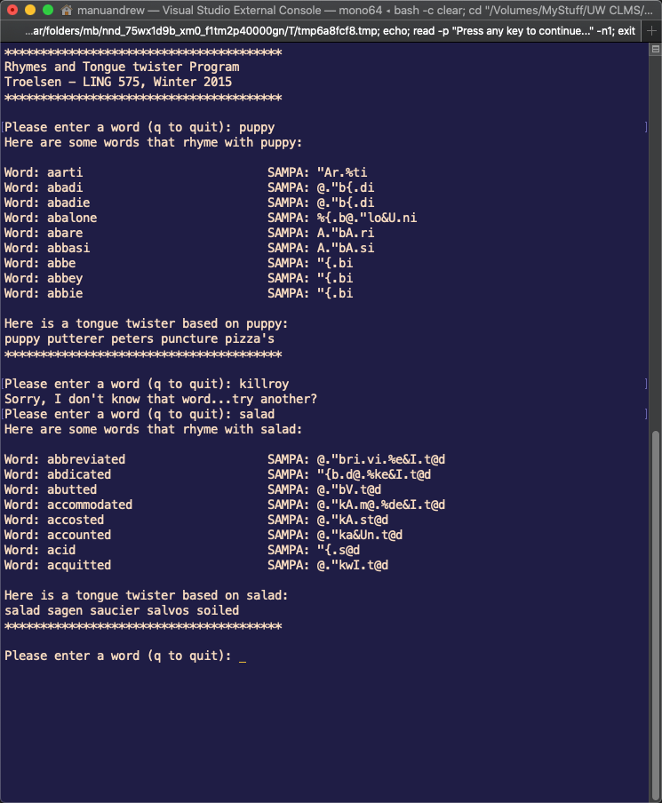

# tongue-twister
Grad school project.  Given a single word, can you build a tongue twister based on a SAMPA database? 

This was fun - basically I had to look at the features of English to figure out what was a close word vowels and consonants.

This was written on VS for Mac on Mono- download and load the *.sln then run.  

https://en.wikipedia.org/wiki/SAMPA_chart_for_English

For the record- I have no idea why all my commits say CommitO...

Some examples:

